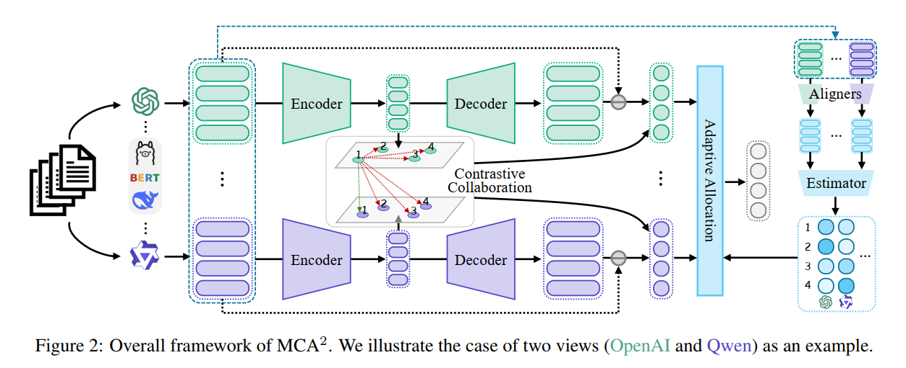
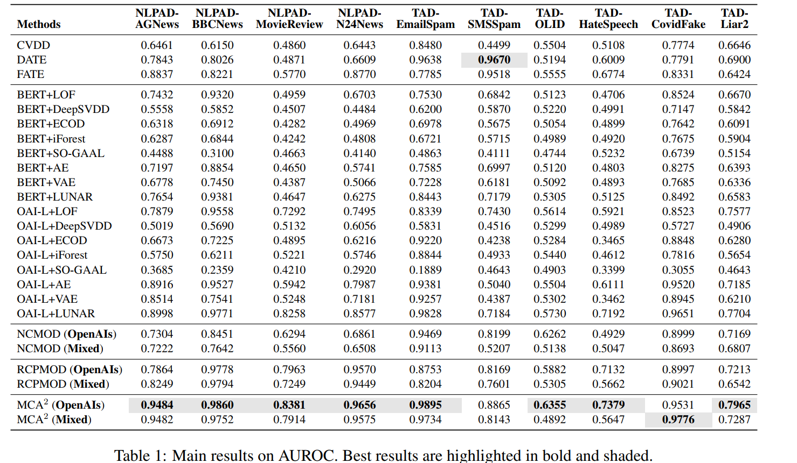

# MCA^2

# Overview
MCA^2 is a two-stage anomaly detection model for multi-view representations.

In Stage 1, we build multiple “views” for each sample (e.g., embeddings generated from different feature sources / different encoders) and save each view as an offline vector representation.

In Stage 2, MCA^2 jointly models these multi-view embeddings and computes anomaly scores.

The model consists of three main components:

- **Multi-view autoencoder**: for each view, we build a dedicated `ViewEncoder`/`ViewDecoder`, map each view input to a latent representation `z` with a shared dimensionality, and constrain reconstruction quality via reconstruction error.
- **Cross-view contrastive consistency**: we apply contrastive learning across latent representations from different views of the same sample to encourage consistency in the latent space (normal samples should be more consistent; anomalies tend to be less consistent).
- **View importance gate (View Importance Gate)**: the model adaptively produces per-view weights from the current batch, and uses them to aggregate reconstruction and contrastive losses. In the implementation, each view is first projected (PCA is used to align different input dimensions to a fixed dimension), then a lightweight MLP outputs normalized view weights.

During inference, MCA^2 combines two signals to obtain the final anomaly score:
- **Reconstruction score**: reconstruction error of each view (optionally weighted by the gate).
- **Consistency score**: contrastive consistency between latent representations across views (also optionally weighted by the gate).
The final score is a weighted sum of the above, which is used to rank samples by anomaly level and evaluate performance.




# Datasets / Embeddings

> Notes:
>
> Our method follows a two-stage pipeline and is not an end-to-end model.
>
> First, we take a piece of text and generate embeddings using large models such as OpenAI-small, BERT, Stella, Qwen, etc., and save them as offline files.
>
> -> Since OpenAI models are not open-sourced, generating embeddings with OpenAI requires payment. We strongly recommend using the embeddings we provide.
>
> Then, based on these offline embeddings, we run our MCA^2 model for anomaly detection.

Recommendations:

- Do not download all 10 datasets/embeddings at once, as they are generally large.
- You may start with the TAD-OLID dataset, which is smaller, and get one dataset running before downloading everything.


**Download our datasets / embeddings from Hugging Face**

> Take TAD-OLID as an example

- URL: https://huggingface.co/datasets/ZhaXinke/MCP2
- Dataset files:
  - On Hugging Face: https://huggingface.co/datasets/ZhaXinke/MCP2/tree/main/data
  - Put them under this project:
    - data/olid.npz
    - data/olid_test_data.jsonl
    - data/olid_train_data.jsonl
- Embedding files:
  - On Hugging Face: https://huggingface.co/datasets/ZhaXinke/MCP2/tree/main/embeddings
  - Put them under this project:
    - embeddings/olid/olid-test/8 embedding files (e.g., bert_olid_test.npy)
    - embeddings/olid/olid-train/8 embedding files (e.g., bert_olid_train.npy)

> Common issues:
>
> If downloads from Hugging Face are too slow due to the large size, you may try the mirror site: https://hf-mirror.com


# Code structure

- data/: datasets
- embeddings/: embeddings 
- multiview_two_stage/: MCA^2 implementation
- multiview_zhaoyue/baseline/CVDD: CVDD implementation
- multiview_zhaoyue/baseline/DATE: DATE implementation
- multiview_zhaoyue/baseline/FATE: FATE implementation
- multiview_zhaoyue/reference/eval: BERT/OpenAI + 8 anomaly detectors (e.g., LOF) implementation
- multiview_ncmod/: NCMOD implementation
- multiview_rcpmod/: RCPMOD implementation


# Running

## Environment setup

```txt
# Option 1
conda create -n MCA2 python=3.9
conda activate MCA2

pip install torch
pip install sentence-transformers
pip install numpy
pip install transformers
pip install openai
pip install tiktoken
pip install scikit-learn
pip install pandas
pip install tqdm
pip install pyod
pip install accelerate
pip install xformers
pip install openpyxl
```

```txt
# Option 2
# Use our provided environment.yml
conda env create -f environment.yml
```


## Run MCA^2

```txt
conda activate MCA2

cd /multiview_two_stage/eval

# Take the OLID dataset as an example. To reproduce paper results, use: --seeds 41,42,43,44,45
python ourmethod_eval.py --dataset olid
```


## Run Baselines

- CVDD

```txt
conda activate MCA2
cd /multiview_zhaoyue/baseline/CVDD
export HF_ENDPOINT=https://hf-mirror.com
python run.py --dataset olid --seeds 41,42,43,44,45
```

- DATE

```txt
conda activate MCA2
cd /multiview_zhaoyue/baseline/DATE
export HF_ENDPOINT=https://hf-mirror.com
python run.py --dataset olid --seeds 41,42,43,44,45
```

- FATE

```txt
conda activate MCA2
cd /multiview_zhaoyue/baseline/FATE
export HF_ENDPOINT=https://hf-mirror.com
python run.py --dataset olid --seeds 41,42,43,44,45
```

- BERT + 8 anomaly detection algorithms (e.g., LOF)

```txt
conda activate MCA2
cd /multiview_zhaoyue/reference
python eval.py --model bert --dataset olid --seeds 41,42,43,44,45
```

- OpenAI + 8 anomaly detection algorithms (e.g., LOF)

```txt
conda activate MCA2
cd /multiview_zhaoyue/reference
python eval.py --model openai_large --dataset olid --seeds 41,42,43,44,45
```

- NCMOD

```txt
conda activate MCA2
cd /multiview_ncmod
python run.py --dataset olid --seeds 41,42,43,44,45
```

- RCPMOD

```txt
conda activate MCA2
cd multiview_rcpmod/eval
python ourmethod_eval.py --dataset olid --seeds 41,42,43,44,45
```





## Citation

If you find this work useful, please cite our paper:

```txt
@article{liu2026beyond,
  title={Beyond a Single Perspective: Text Anomaly Detection with Multi-View Language Representations},
  author={Yixin Liu, Kehan Yan, Shiyuan Li and others},
  journal={arXiv preprint arXiv:2601.17786},
  year={2026}
}
```


# FAQ

## (1) How to create embeddings

> If you want to extend NLP anomaly detection to **new datasets beyond this paper**
>
> This section explains how to generate embeddings.
>
> Run `python Bert_embedding.py --dataset <new_dataset_name>` to generate BERT text embeddings for the dataset.
>
> Similarly, you also need to generate embeddings for other models such as Qwen, Llama, OpenAI-small, OpenAI-ada, OpenAI-large, etc. The relevant Python scripts are in the embeddings folder.
>
> If you want to generate embeddings using OpenAI models, you need to add your OpenAI API key in the code:
>
>       ```txt
>       client = OpenAI(
>           base_url= "https://api.chatanywhere.tech/v1",
>           api_key = 'xxx'
>       )
>       ```
>
> -> Token usage for this key is paid. We do not provide an API key.
>
> If you encounter a 403 network error:
>
> You can run: `export HF_ENDPOINT=https://hf-mirror.com`
>
> to use the Hugging Face mirror.

## (2) 403 error when running end-to-end baseline code

For example, CVDD/DATE/FATE.

-> This is due to network restrictions in some regions (e.g., without VPN access).

We recommend using the Hugging Face mirror by running: `export HF_ENDPOINT=https://hf-mirror.com`


